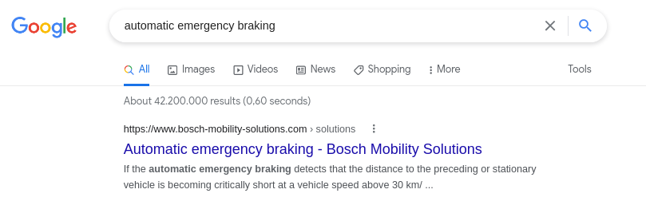
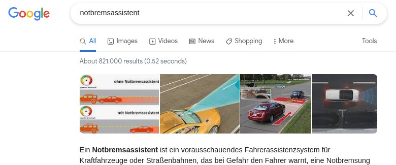

# 🦖 BiTe-REx: **Bi**lingual **Te**xt **R**etrieval **Ex**planations in the Automotive domain

Find the demo application here: [BiTe-REx](https://bite-rex-demo.herokuapp.com/).

#### Have you ever searched for _notbremsassistent_ in a regular search engine and felt you missed out search results just because you searched in German? Wouldn't you expect better and relevant results from other languages, as well?

----

To motivate further, check what Google gives as search results for the same query (though in different languages). You may note the number of search results and the language of results and try to answer the question that follows. 

#### Do these search results (individually) satiate your comprehensive information need?

To add a bit more perspective, read through the **_Whys_**!

## Why do I need a Bilingual Text Retrieval system?

Cross-lingual Text retrieval (or, CLTR) system retrieves results from a collection of documents transcending the boundaries of language. We can seek aid of word representations like word2vec or fastText and the more recent transformer-based models like BERT to get embeddings in a common space. Thinking beyond the language we speak is indeed the pre-requisite in this age of booming information and to facilitate this, our search systems (or, Internet in general) should not be *just as big as the language we speak*. 

Read more about the digital language divide [here](http://labs.theguardian.com/digital-language-divide/). 

## Why do I need an Explainable system?

How often have you wondered why you got a particular search result in the top when you typed in a specific query? Was the reason ever clear - similarity in the topic, common words or something more abstract that would have contributed to the search result? As a user in this digital age, you are entitled with the *right to obtain an explanation*, provided the decision has been made by an automated decision maker. This prompts the search engines to not just give you the search results but also reason why those results were returned.

Read more about Recital 71 from EU GDPR [here](https://www.privacy-regulation.eu/en/recital-71-GDPR.htm).

---
